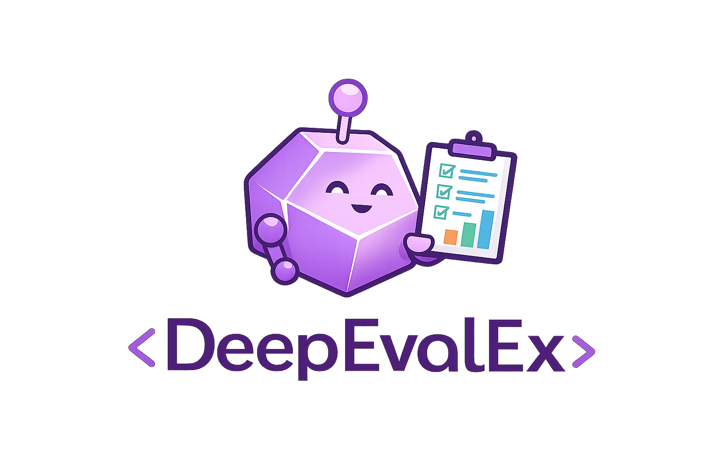

<p align="center">
  
</p>

<p align="center">
  <a href="https://github.com/holsee/deep_eval_ex/actions/workflows/ci.yml"></a>
  <a href="https://hex.pm/packages/deep_eval_ex"></a>
  <a href="https://hexdocs.pm/deep_eval_ex"></a>
  <a href="https://github.com/holsee/deep_eval_ex/blob/main/LICENSE"></a>
</p>

# DeepEvalEx

LLM evaluation framework for Elixir - Idiomatic + Compatible Elixir port of [DeepEval](https://github.com/confident-ai/deepeval).

> **Attribution**: This project is a derivative work of [DeepEval](https://github.com/confident-ai/deepeval)
> by [Confident AI](https://confident-ai.com), licensed under Apache 2.0. The core evaluation
> algorithms, metrics, and prompt templates are derived from the original Python implementation.

## Installation

Add `deep_eval_ex` to your list of dependencies in `mix.exs`:

```elixir
def deps do
  [
    {:deep_eval_ex, "~> 0.1.0"}
  ]
end
```

## Quick Start

```elixir
# Create a test case
test_case = DeepEvalEx.TestCase.new!(
  input: "What is the capital of France?",
  actual_output: "The capital of France is Paris.",
  expected_output: "Paris"
)

# Evaluate with ExactMatch metric
{:ok, result} = DeepEvalEx.Metrics.ExactMatch.measure(test_case)

# Check result
result.score      # => 0.0 (not an exact match)
result.success    # => false
result.reason     # => "The actual and expected outputs are different."
```

## Configuration

Configure your LLM provider in `config/config.exs`:

```elixir
config :deep_eval_ex,
  default_model: {:openai, "gpt-4o-mini"},
  openai_api_key: System.get_env("OPENAI_API_KEY"),
  default_threshold: 0.5
```

## Available Metrics

| Metric | Purpose |
|--------|---------|
| **ExactMatch** | Simple string comparison |
| **GEval** | Flexible criteria-based evaluation using LLM-as-judge |
| **Faithfulness** | RAG: claims supported by retrieval context |
| **Hallucination** | Detects unsupported statements |
| **AnswerRelevancy** | Response relevance to input question |
| **ContextualPrecision** | RAG retrieval ranking quality |
| **ContextualRecall** | RAG coverage of ground truth |

See the [Metrics Overview](wiki/metrics/Overview.md) for detailed documentation on each metric.

## Documentation

| Guide | Description |
|-------|-------------|
| [Quick Start](wiki/guides/Quick-Start.md) | Get up and running in 5 minutes |
| [Configuration](wiki/guides/Configuration.md) | LLM provider setup and options |
| [Metrics Overview](wiki/metrics/Overview.md) | All available metrics explained |
| [ExUnit Integration](wiki/guides/ExUnit-Integration.md) | Test assertions for CI/CD |
| [Custom Metrics](wiki/guides/Custom-Metrics.md) | Build your own evaluation metrics |
| [Telemetry](wiki/guides/Telemetry.md) | Observability and monitoring |

### API Reference

- [TestCase](wiki/api/TestCase.md) - Test case structure
- [Result](wiki/api/Result.md) - Evaluation results
- [Evaluator](wiki/api/Evaluator.md) - Batch evaluation
- [LLM Adapters](wiki/api/LLM-Adapters.md) - Provider adapters

### Architecture

- [Architecture Decision Records](docs/adr/README.md) - Design decisions and rationale

## LLM Adapters

DeepEvalEx supports multiple LLM providers:

- **OpenAI** - GPT-4o, GPT-4o-mini, GPT-3.5-turbo
- **Anthropic** - Claude 3 family (planned)
- **Ollama** - Local models (planned)

See [LLM Adapters](wiki/api/LLM-Adapters.md) and [Custom LLM Adapters](wiki/guides/Custom-LLM-Adapters.md) for details.

## Usage with ExUnit

```elixir
defmodule MyApp.LLMTest do
  use ExUnit.Case

  alias DeepEvalEx.{TestCase, Metrics}

  test "LLM generates accurate responses" do
    test_case = TestCase.new!(
      input: "What is 2 + 2?",
      actual_output: get_llm_response("What is 2 + 2?"),
      expected_output: "4"
    )

    {:ok, result} = Metrics.ExactMatch.measure(test_case)
    assert result.success, result.reason
  end
end
```

## Concurrent Evaluation

Evaluate multiple test cases concurrently:

```elixir
test_cases = [
  TestCase.new!(input: "Q1", actual_output: "A1", expected_output: "A1"),
  TestCase.new!(input: "Q2", actual_output: "A2", expected_output: "A2")
]

results = DeepEvalEx.evaluate_batch(test_cases, [Metrics.ExactMatch],
  concurrency: 20
)
```

## Telemetry

DeepEvalEx emits telemetry events for observability:

```elixir
:telemetry.attach("my-handler", [:deep_eval_ex, :metric, :stop], fn _event, measurements, metadata, _config ->
  IO.puts("Metric #{metadata.metric} completed with score #{measurements.score}")
end, nil)
```

See [Telemetry Guide](wiki/guides/Telemetry.md) for all events and integration patterns.

## License

Apache 2.0 - See [LICENSE](LICENSE) and [NOTICE](NOTICE) for details.

This project is a derivative work of [DeepEval](https://github.com/confident-ai/deepeval)
by Confident AI, also licensed under Apache 2.0.
